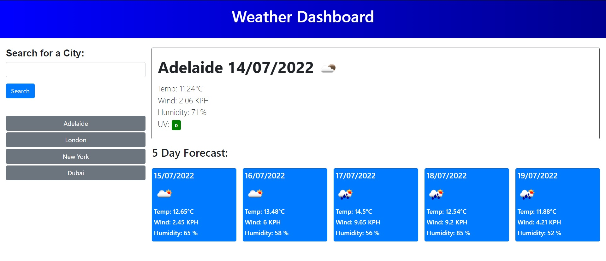

# Weather-Dashboard

## Description

This is a web site that enables the user to search for the weather information on any city they search.

The weather dashboard has the following functions
- The user can write any city they like and get its forcast.
- The forcast will presented with the city name, the date, an icon representation of weather conditions, the temperature, the humidity, the wind speed, and the UV index.
- The UV index is colour coded to highlight possible UV danger or favourable (green), moderate (orange) or severe (red).
- The user is presented with a 5-day forecast that displays the date, an icon representation of weather conditions, the temperature, the wind speed, and the humidity
- Once the user has searched for a city, that city is added to a search history on the left of the page.
- The search history is saved to local storage and loaded bach to the history area when the page is reloaded.
- The user can use the buttons in the history area to search that cities information again.

 

## Table of Contents

- [Deployed Link](#Link)
- [Screenshot](#Screenshot)
---

## Link

The link to the deployed website of the assignment is  
[https://jkoufalas.github.io/Weather-Dashboard/index.html](https://jkoufalas.github.io/Weather-Dashboard/index.html)

---
## Screenshot

This image provides a sample of the completed website.

